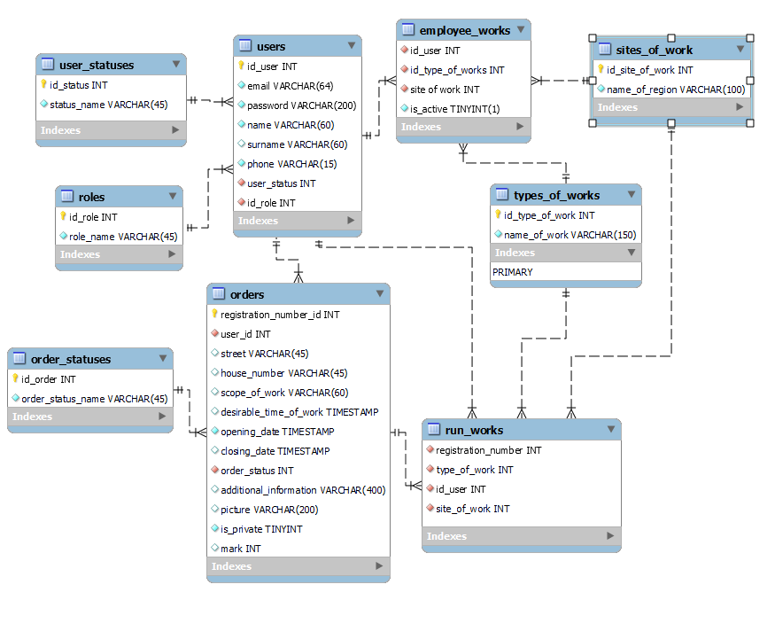

# Housing and communal services system
The website housing and communal services was created to order housing 
and communal services by users. After the user leaves the order, 
the administrator must process it, determine the type of work and assign the contractor. 
The contractor can view the applications assigned to him or take them himself.
## Roles in project
### Unauthorised user
- View the home page
- Sign in
- Sign up
### USER
- Edit personal information
- Make new order
- Cancel order
- Log out
- Change password
- Update profile
### Admin
- Log out
- Change password
- Update profile
- 
### Employee
- Log out
- Change password
- Update profile
- 
## DataBase Scheme

- [script.sql](https://github.com/)
