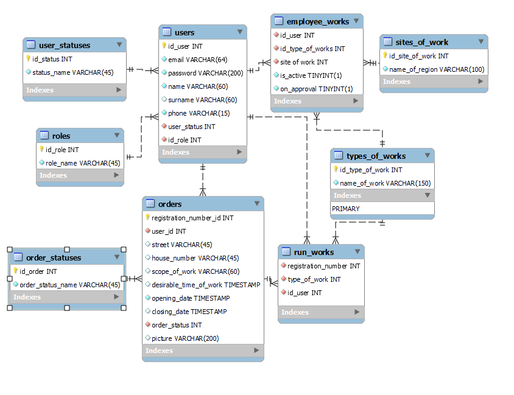

# Housing and communal services system
The website housing and communal services was created to order housing 
and communal services by users. After the user leaves the order, 
the administrator must process it, determine the type of work and assign the contractor. 
The contractor can view the applications assigned to him or take them himself.
## Roles in project
### Unauthorised user
- View the home page
- Sign in
- Sign up
### USER
- Edit personal information
- Make new order
- Cancel order
- Log out
- Change password
- Update profile
- View his orders
- Cancel order
- Register as employee
### Admin
- Edit personal information
- Log out
- Change password
- Update profile
- Assign a performer
- Build a report "all users"
- Build a report "all orders"
- Check the applications of specialists for work and approve it or reject
- Check closed applications
- Change user role
### Employee
- Edit personal information
- Log out
- Change password
- Update profile
- Take an order
- Close or cancel order
## DataBase Scheme

- [script.sql](https://github.com/amelenas/final_project_zkh/tree/master/database)
